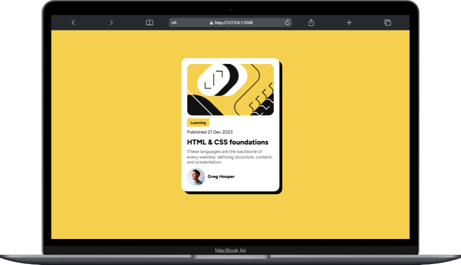
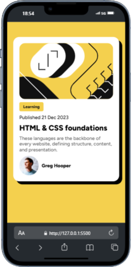

<h1>📰 Blog Preview Card</h1>

  Projeto desenvolvido com o objetivo de aprimorar conceitos de HTML e CSS, aplicando boas práticas na criação de componentes visuais reutilizáveis.
  O Blog Preview Card simula um cartão de visualização de artigo, sendo uma interface limpa, responsiva e moderna.

<h2>🔎 Objetivo</h2>

<ul>
  <li>Aplicar técnicas de estilização e responsividade utilizando CSS.</li>
  
  <li>Reproduzir um componente comum em interfaces de blogs e sites de notícias.</li>
</ul>

<h2>🚀 Funcionalidades</h2>

<ul>
  <li>Estrutura de cartão responsivo.</li>
  
  <li>Exibição de imagem de capa, título, descrição e autor.</li>
    
  <li>Layout adaptável a diferentes resoluções de tela.</li>
</ul>

<h2>🛠️ Tecnologias Utilizadas</h2>

<ul>
  <li>HTML5</li>
  
  <li>CSS3</li>
</ul>

<h2>📸 Demonstração</h2>

<ul>
  <li style="text-align: center;">
    <h3>Desktop</h3>
     
    
  </li>
  
  <li style="text-align: center;">
    <h3>Mobile</h3>
     
    
  </li>
</ul>

<h2>📈 Aprendizados</h2>

<h3>
  Durante o desenvolvimento deste projeto, foi possível consolidar conhecimentos relacionados a:
</h3>

<ul>
  <li>Boas práticas de design responsivo.</li>
  
  <li>Criação de componentes reutilizáveis em front-end.</li>
</ul>
